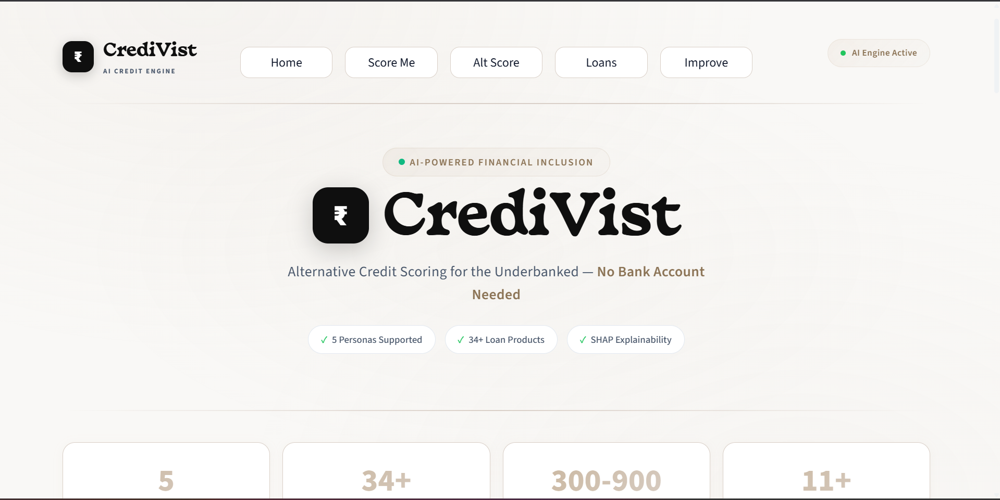
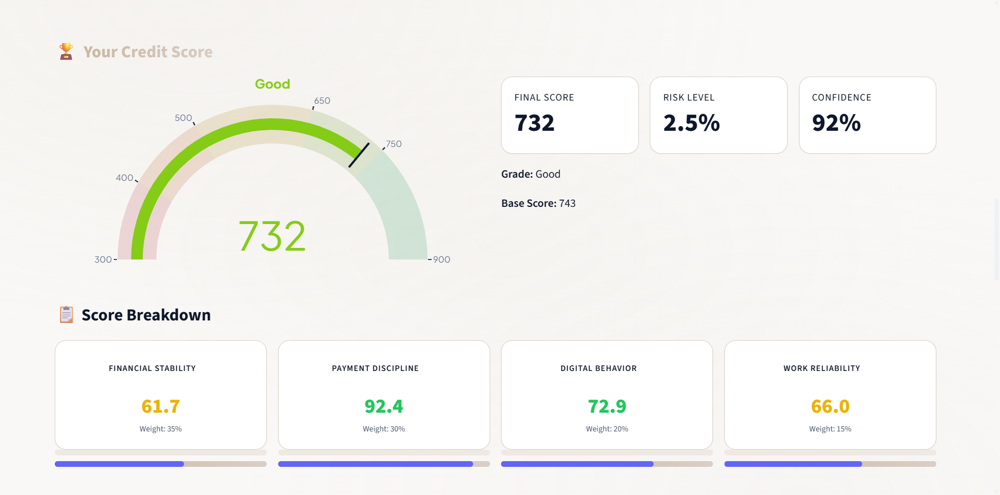
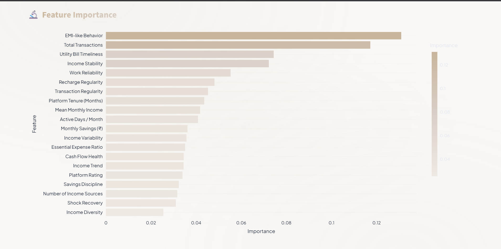

# 🏦 CrediVist — Alternative Credit Scoring Engine

> Empowering the underbanked with AI-driven credit assessment using alternative data signals.


---

## 🎯 Problem Statement

Over **1.7 billion adults** worldwide remain unbanked or underbanked, lacking access to formal credit due to the absence of traditional credit history (like CIBIL scores). Gig workers, street vendors, and informal workers often have no payslips, credit cards, or loans to generate a score — yet many are financially responsible.

**CrediVist** solves this by building an **Alternative Trust Score (300–900)** using non-traditional data signals like:

- Cash flow patterns
- Utility bill payment behavior
- Mobile recharge regularity
- Gig platform tenure and ratings
- Transaction regularity & expense discipline

---

## 📸 Screenshot

<p align="center">
        
        
        
</p>

---

## 🏗 Architecture

```
Raw Financial Data
        ↓
Feature Engineering Engine (10 Alternative Criteria)
        ↓
4 Sub-Scores (Rule-Based Structured Scoring)
        ↓
ML Risk Adjustment Model (XGBoost + Logistic Regression Ensemble)
        ↓
Final Alternative Trust Score (300 – 900)
        ↓
Explainability Layer (SHAP)
```

### 10 Alternative Credit Criteria

| #   | Criteria                   | Signal                                      |
| --- | -------------------------- | ------------------------------------------- |
| A   | Income Stability Index     | Month-to-month variance, consistency, trend |
| B   | Cash Flow Health Ratio     | (Income - Fixed Expenses) / Income          |
| C   | Income Source Diversity    | Multiple gig platforms = lower risk         |
| D   | Utility Bill Timeliness    | On-time payment rate, delay penalties       |
| E   | EMI-Like Pattern Detection | Recurring payment recognition               |
| F   | Transaction Regularity     | Weekly transaction consistency              |
| G   | Expense Categorization     | Essential vs entertainment spending ratio   |
| H   | Savings Behavior           | Recurring savings, minimum balance          |
| I   | Platform Tenure & Rating   | Gig platform performance proxy              |
| J   | Shock Recovery Score       | Income dip recovery speed                   |

### 4 Sub-Scores

| Sub-Score           | Weight | Components                                |
| ------------------- | ------ | ----------------------------------------- |
| Financial Stability | 35%    | Income stability, cash flow, savings      |
| Payment Discipline  | 30%    | Utility bills, EMI behavior, recharge     |
| Digital Behavior    | 20%    | Transaction regularity, expense ratio     |
| Work Reliability    | 15%    | Tenure, rating, diversity, shock recovery |

---

## 🚀 Quick Start

### 1. Install Dependencies

```bash
pip install -r requirements.txt
```

### 2. Generate Synthetic Data

```bash
python data/generate_synthetic_data.py
```

### 3. Run the Application

```bash
streamlit run app.py
```

The app will open at `http://localhost:8501`

---

## 📂 Project Structure

```
CrediVist/
├── app.py                              # Streamlit main application
├── requirements.txt                    # Python dependencies
├── README.md                           # This file
├── data/
│   ├── generate_synthetic_data.py      # Synthetic data generator
│   └── credit_data.csv                 # Generated dataset (auto-created)
├── src/
│   ├── __init__.py
│   ├── feature_engineering.py          # 10 feature extraction functions
│   ├── scoring_engine.py              # Sub-score system & final scoring
│   ├── ml_model.py                    # XGBoost + LR training & prediction
│   └── explainability.py             # SHAP-based explanations
├── models/
│   └── credit_risk_model.pkl          # Saved trained model (auto-created)
└── assets/
```

---

## 🖥 App Features

| View                    | Description                                                                         |
| ----------------------- | ----------------------------------------------------------------------------------- |
| **Individual Score**    | Detailed credit assessment for any user with gauge, breakdown, and SHAP explanation |
| **Portfolio Analytics** | Population-level insights: score distribution, grade breakdown, risk scatter plot   |
| **Model Performance**   | ML metrics: accuracy, ROC AUC, confusion matrix, feature importance                 |
| **Score Simulator**     | Interactive sliders to test "what-if" scenarios and see real-time score changes     |

---

## 🧠 AI/ML Integration

- **XGBoost Classifier** — primary risk prediction model
- **Logistic Regression** — secondary model for ensemble averaging
- **Ensemble Strategy** — 60% XGBoost + 40% LR for robust predictions
- **SHAP (SHapley Additive exPlanations)** — individual and global explainability
- **Feature Importance** — transparent ranking of what drives the score

---

## 📊 Tech Stack

| Component      | Technology            |
| -------------- | --------------------- |
| Backend        | Python, Pandas, NumPy |
| ML             | Scikit-learn, XGBoost |
| Explainability | SHAP                  |
| Frontend       | Streamlit             |
| Visualization  | Plotly, Matplotlib    |

---

## 🏆 Competitive Differentiators

1. **Hybrid Scoring** — Rule-based sub-scores + ML risk adjustment (not pure black-box)
2. **10 Alternative Criteria** — Goes beyond traditional credit, targeting gig/informal economy
3. **SHAP Explainability** — Every score comes with human-readable reasons
4. **Score Confidence** — Transparent about data quality driving the assessment
5. **Real-time Simulator** — Interactive "what-if" tool for financial literacy

---

## 👥 Team CrediVist

Built with ❤️ for hackathon by **Abhishek Allipur**

---

## 📝 License

MIT License — feel free to use, modify, and distribute this project.
